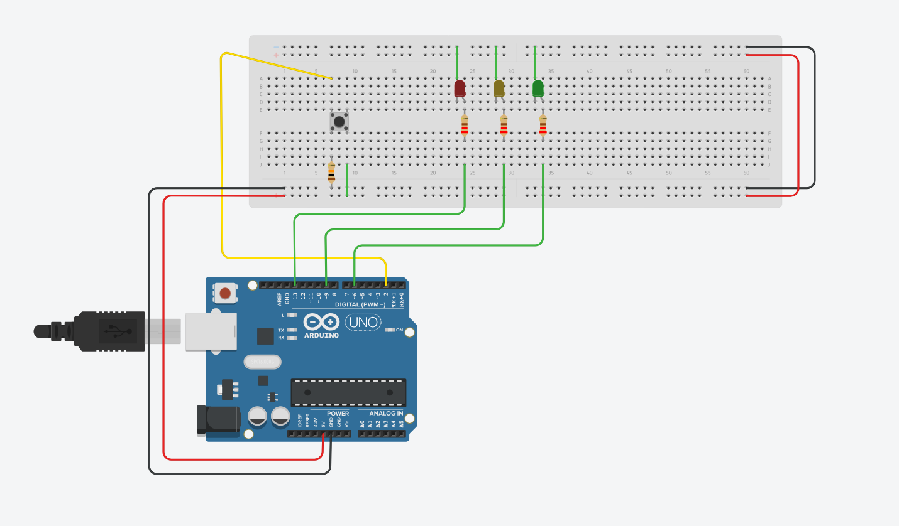
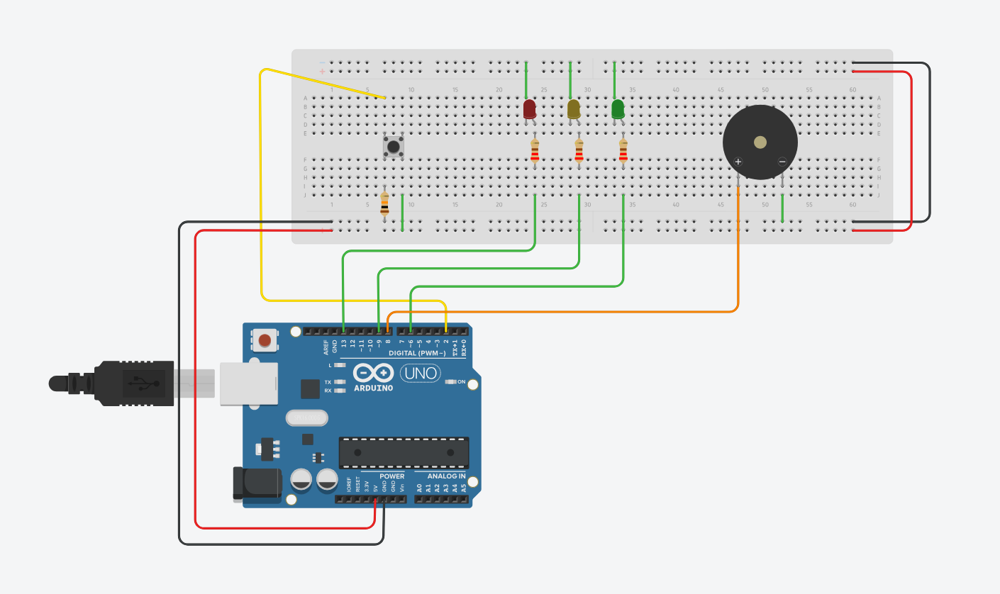

## Building A Traffic Light Step by Step

[code](switch_multiled_traffic.ino)

### Adding a Buzzer

[code](switch_multiled_traffic_switch_buzzer.ino)

- adding a flashing pedestrian light
- using interrupts instead of delays
